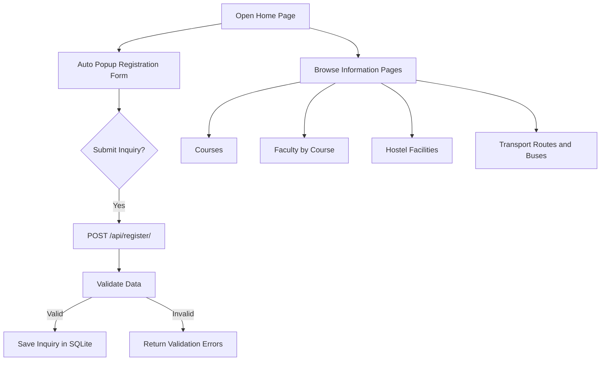
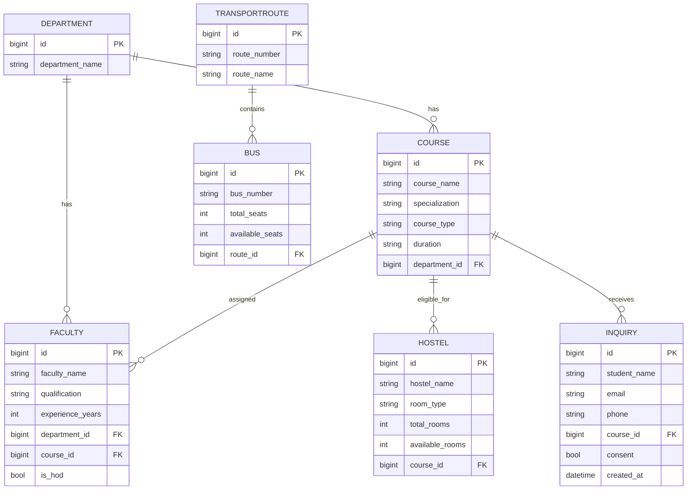

# Chanakya University Inquiry System

A full stack Django + Django REST Framework application for inquiry registration and information display for courses, faculty, hostel, and transport facilities.

## 1) System Flowchart (Explanation)

1. Visitor opens website home URL.
2. Popup inquiry form appears automatically.
3. User fills details and submits form.
4. Frontend sends POST request to `/api/register/`.
5. Backend validates data and stores inquiry in SQLite.
6. User browses Courses / Faculty / Hostel / Transport pages.
7. Pages and APIs fetch and present data from database.

### Flowchart (Mermaid)



## 2) ER Diagram (Explanation)

- One Department has many Courses.
- One Department has many Faculty.
- One Course has many Faculty.
- One Course has many Hostel records.
- One Course has many Inquiry records.
- One TransportRoute has many Bus records.

### ER Diagram (Mermaid)



## 3) Database Table Structure

### Department
- id (PK)
- department_name

### Course
- id (PK)
- course_name
- specialization
- course_type (UG / PG)
- duration
- department_id (FK -> Department)

### Faculty
- id (PK)
- faculty_name
- qualification
- experience_years
- department_id (FK -> Department)
- course_id (FK -> Course)
- is_hod

### Hostel
- id (PK)
- hostel_name
- room_type (Single / Double / Shared)
- total_rooms
- available_rooms
- course_id (FK -> Course)

### TransportRoute
- id (PK)
- route_number
- route_name

### Bus
- id (PK)
- bus_number
- total_seats
- available_seats
- route_id (FK -> TransportRoute)

### Inquiry
- id (PK)
- student_name
- email
- phone
- course_id (FK -> Course)
- consent
- created_at

## 4) Key Backend Files

- Models: app-level `models.py` files in each app
- Serializers: app-level `serializers.py` files
- APIs + page views: `inquiry/views.py`
- Routing: `inquiry/urls.py`, `chanakya_project/urls.py`
- Admin: app-level `admin.py` files

## 5) API Endpoints

### POST
- `/api/register/` : Register inquiry details

### GET
- `/api/courses/` : List all courses
- `/api/faculty/<course_id>/` : List faculty for a course
- `/api/hostel/` : List hostel facilities
- `/api/transport/` : List routes and buses per route

## 6) API Integration Examples

### Register Inquiry (PowerShell)

```powershell
$body = @{
  student_name = "Aarav"
  email = "aarav@example.com"
  phone = "9876543210"
  course = 1
  consent = $true
} | ConvertTo-Json

Invoke-WebRequest -Method Post \
  -Uri http://127.0.0.1:8000/api/register/ \
  -ContentType "application/json" \
  -Body $body
```

### Get Courses (Browser)
- `http://127.0.0.1:8000/api/courses/`

## 7) Frontend Pages

- `/` Home page with auto popup registration form
- `/courses/` Course cards
- `/faculty/` Faculty table filtered by course
- `/hostel/` Hostel cards
- `/transport/` Transport table

## 8) Sample Test Data

Seed command added:

```bash
python manage.py seed_sample_data
```

Adds sample Departments, Courses, Faculty (including HoDs), Hostel facilities, Routes, and Buses.

## 9) Run Instructions

```bash
python manage.py makemigrations
python manage.py migrate
python manage.py seed_sample_data
python manage.py runserver
```

Open: `http://127.0.0.1:8000/`
